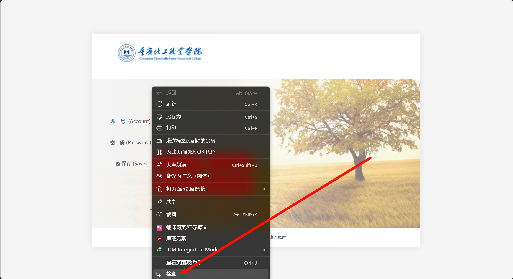
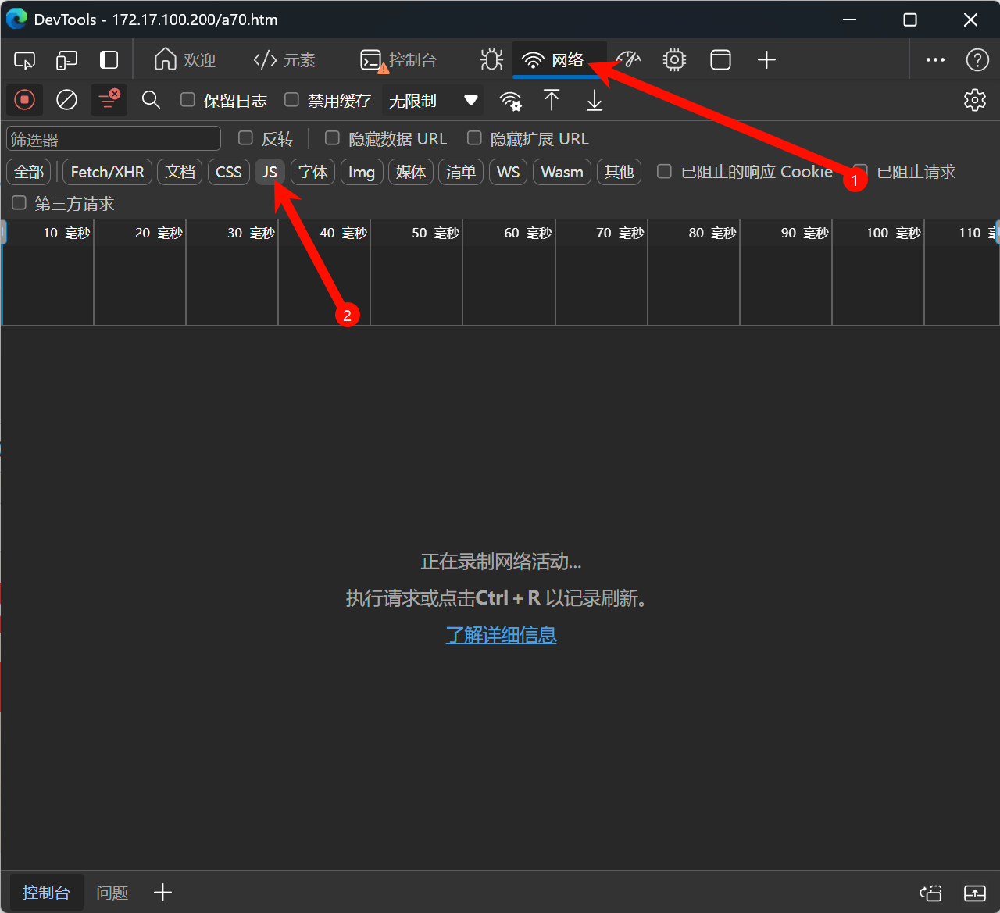
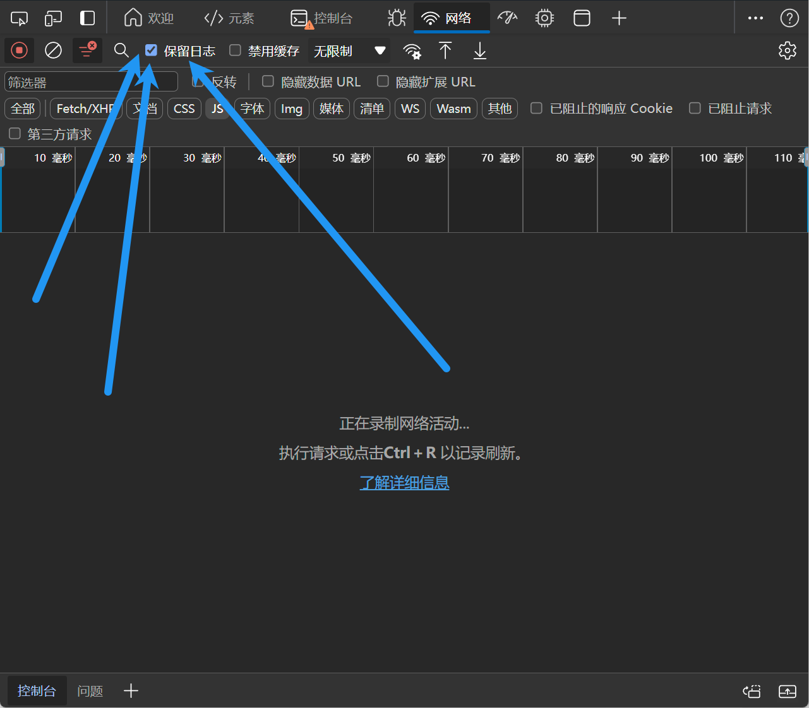
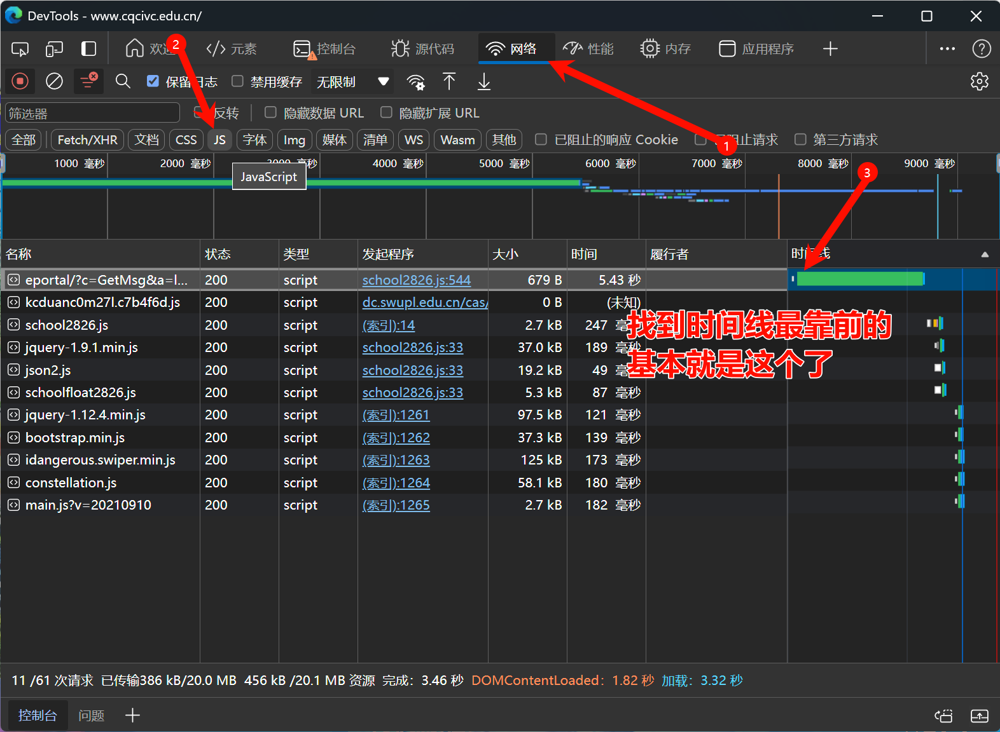
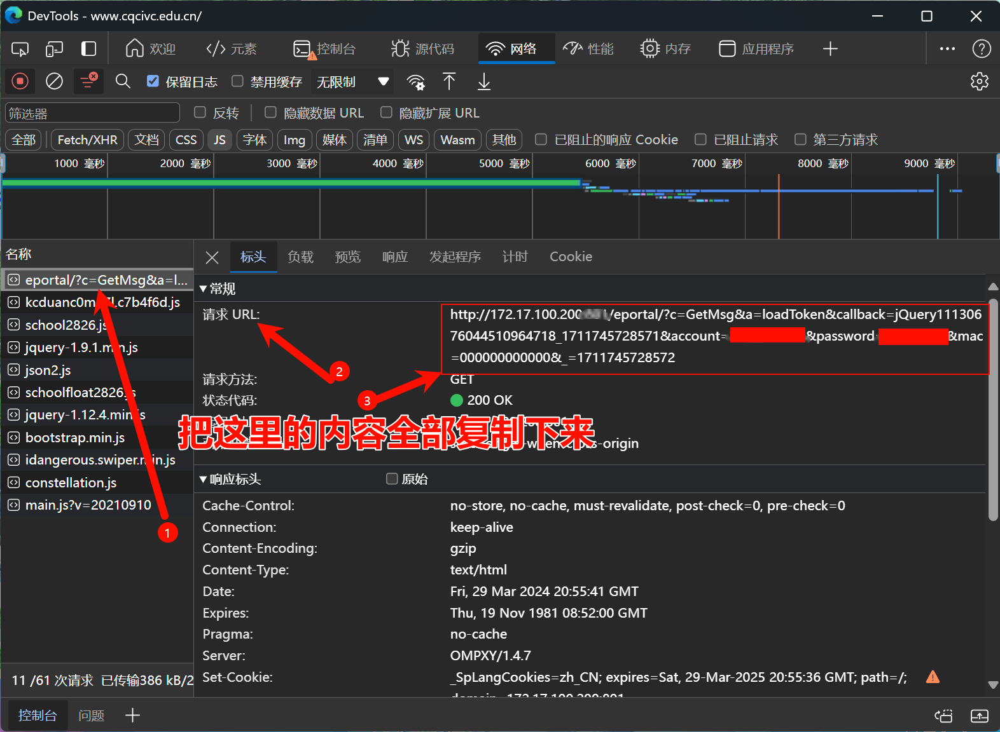

# `本脚本仅供学习交流使用,请勿用于非法用途,否则后果自负!`

#### chen6019 编写,用于登陆校园网(可自行输入网址),生成开机自动登陆脚本,一键打开开机自启文件夹,一键退出等功能

# **`使用步骤:`**

#### `1`. 下载脚本,并放到任意文件夹，需要有写入权限，比如桌面。

#### `2`. 打开`校园网.bat` 脚本,按数字键选择功能

_1_.`打开校园网网址`

    可以自行输入网址
    默认网址为重庆化工职业学院的！
    其他学校的请自行输入！

_2_.`生成开机自动登陆脚本`

    在获取到登陆链接后运行此功能
    可以根据提示自动生成开机自动登陆脚本
    并复制到开机自启动目录
    
       _______如何获取见后文________

_3_.`一键打开开自启文件夹`

    顾名思义
    打开开机自启动目录文件夹

_4_.`打开仓库网址(一般用于更新脚本)`

    顾名思义
    打开本仓库

_5_.`一键退出`

    顾名思义
    直接关闭脚本

# **`获取登陆链接`**

## 第一步:

打开浏览器,打开`校园网登陆页面`

这个应该不用我教把,大家都懂的吧

`一般情况`下没登陆校园网时

打开浏览器会`自动`打开这个网页的

## 第二步:

输入`用户名`和`密码`

## 第三步:

按键盘上的`F12`按钮

或者

`单击右键`选择`检查`

## 第四步:

在`Network`or`网络`or`wifi`图标标签页下

筛选`javascript`简称`js`文件

## 记得勾选`保留日志`

## 第五步:

点击`登陆`按钮

## 第六步:

观察`时间线`最靠前的`请求`

## 第七步:

点击查看`标头`
复制`URL`地址里的所有内容

# 你已经成功获取了登陆链接

# 请将其粘贴到`生成开机自动登陆脚本`功能中进行登陆
